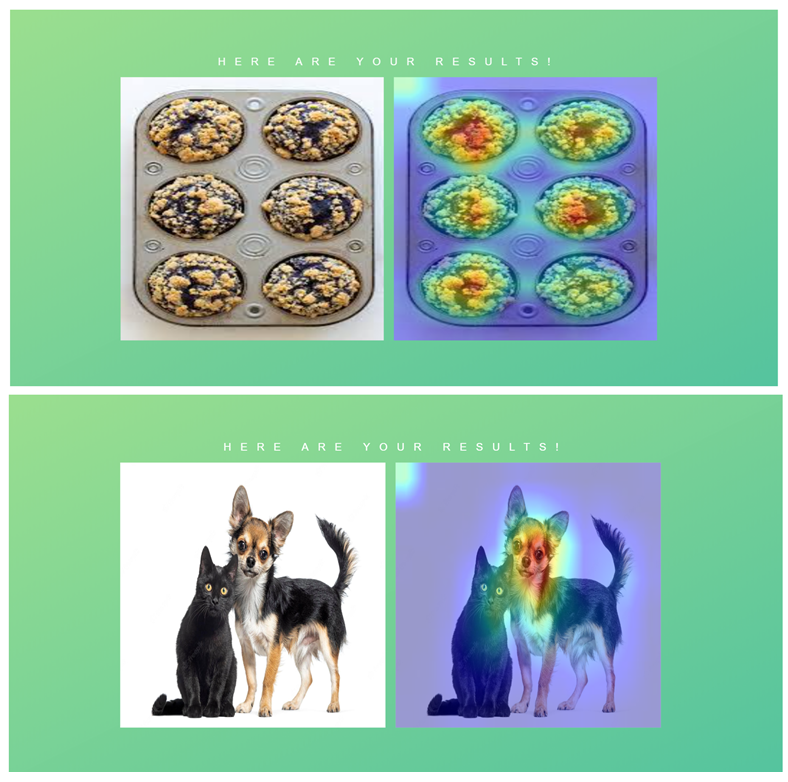

# Grad-CAM

## Introduction

This project aims to visualize heatmaps showing what feature the model used to make its prediction

If you dont have Python installed in your PC ,it can be installed from here [python](https://www.python.org/downloads/).

Hit the command in CMD/Terminal if you don't have it already installed:

    pip install opencv-python

   (OR)
   
 Install OpenCV via anaconda
  
    conda install -c menpo opencv
    
## How to run the code
Clone the Repository and extract the files

1. Go to the folder where app.py file is present
2. Type cmd in the file path 
3. Run the code with command `python app.py`
4. Upload your image and click on upload to see your heatmaps !

## Output

